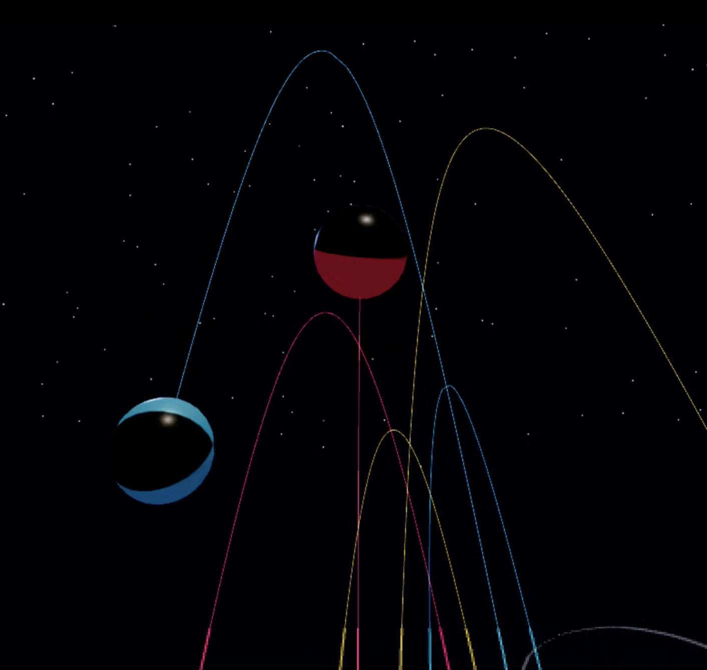

# Juggle VR — Project Summary

VR juggling game built with Three.js and WebXR. Run locally with Node, use Quest (or compatible headset) to juggle balls with hand tracking and auto-catch/throw logic.

**Live:** https://shellsi.github.io/juggle-vr/

---

## Stack

- **Runtime**: ES modules, importmap (no bundler)
- **3D**: Three.js 0.170.0 (CDN: jsdelivr)
- **VR**: WebXR (`VRButton`, `XRControllerModelFactory`, `Reflector`)
- **Server**: Node HTTPS (port 8443) + HTTP fallback (3001). Requires `key.pem` and `cert.pem` for WebXR.

---

## Layout

| File | Role |
|------|------|
| `index.html` | Entry point, importmap, info overlay |
| `main.js` | Scene, controllers, balls, game loop (~1180 lines) |
| `server.js` | Static file server (HTTPS + HTTP) |
| `key.pem`, `cert.pem` | TLS certs for WebXR (local) |

---

## Controls

| Input | Action |
|-------|--------|
| **Auto-catch** | Ball enters ~9cm zone around grip → caught |
| **Throw** | Grip squeeze + release while hand moves **up** → throw top ball |
| **Trigger** | Ray-grab: point at ball, pull trigger → ball slides to hand |
| **Right A** | Toggle auto-throw (automatic upward toss after short hold) |
| **Right B** | Toggle flat-plane constraint (lock Z when released) |
| **Right stick Y** | Adjust gravity (10%–100%) |
| **Right stick X** | Add/remove balls (1–9) |
| **Left X** | Toggle smoke trails (controller + ball) |

---

## Ball States

- **waiting** — Not launched yet
- **free** — In flight, physics + trail recording
- **held** — Attached to grip, parented to controller
- **sliding** — Moving from ray-grab to hand (0.6s ease-out)

Trail: recorded only while `free`; one extra point at catch location before the held break marker.

---

## Trail System

- **Controller trails**: Ribbon (quads) with pitch-based width + **width inversely proportional to controller speed**. Left = cyan, right = orange.
- **Ball trails**: Line strip, raw positions, age-based fade + Z scroll. No explicit smoothing. Break marker (`null`) during hold.

Constants: `TRAIL_LENGTH` 400, `TRAIL_SCROLL_SPEED` 0.5 m/s, ribbon width clamps, speed ref/epsilon.

---


## Animation Loop Order

1. Auto-launch balls (VR start)
2. Controller `updateVelocity(dt)`
3. Gravity / ball count (thumbstick)
4. `checkAutoCatch()`
5. `checkThrowOnGripRelease()`
6. `checkTriggerGrab()`
7. `checkAutoThrow()` (if enabled)
8. A/B toggles
9. Controller trail `updateTrail(now)`
10. Ball `update(dt)` (physics + trail recording)
11. Ball trail `updateTrail(now)`
12. Render

---

## Key Constants

| Name | Value | Purpose |
|------|-------|---------|
| `CATCH_RADIUS` | 0.09 m | Proximity for auto-catch |
| `BALL_RADIUS` | 0.04 m | Ball size |
| `THROW_VELOCITY_SCALE` | 1.2 | Throw strength multiplier |
| `MIN_THROW_UP` | 1.5 m/s | Minimum upward velocity |
| `FLAT_PLANE` | on by default | Constrains Z when released |

---

## Future Enhancements

- **Super Hot–style slow-mo time** — Time slows when you slow down
- **Start with balls in hands** — Balls begin held, no auto-launch (implemented)
- **Balls stack backwards from centre** — Top ball (next to throw) at centre, others back (implemented)
- **Pass-through mixed reality** — See real room while juggling
- **Clubs** — Juggling clubs instead of (or in addition to) balls
- **Hand tracking (open/close)** — Natural grip via hand pose, no controller (implemented)
- **Rotational velocity** — Spin transfer from hands to balls (implemented)
- **Bounce juggling** — Balls bounce off floor between catches

---

## Running

```bash
node server.js
```

- **VR**: `https://localhost:8443` (Quest: accept cert warning → Enter VR)
- **Desktop**: `http://localhost:3001` (preview, no VR)
